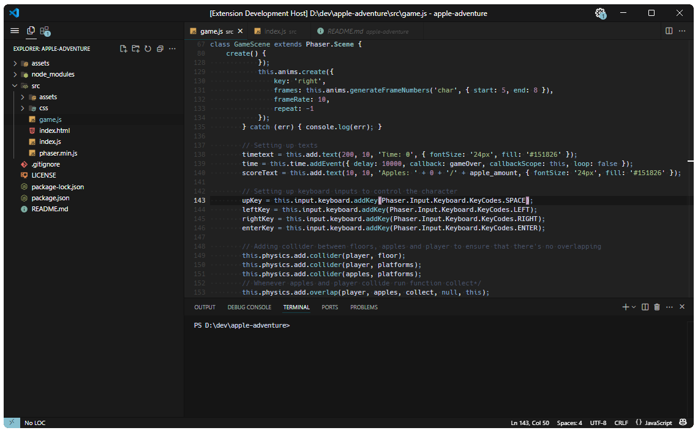

# Nord Dark Contrast

    
    

    A more contrast version of the <a target='_blank' href='https://marketplace.visualstudio.com/items?itemName=dnlytras.nord-wave'>Nord Wave</a> theme.
    

### Example

## Recommendations for used settings and extensions

Install following extensions
- [City Lights Icon package (Black & White)](https://marketplace.visualstudio.com/items?itemName=Yummygum.city-lights-icon-vsc) &#8211; A minimal black & white file icon package for minimal distractions.
- [Fluent Icons](https://marketplace.visualstudio.com/items?itemName=miguelsolorio.fluent-icons)                                &#8211; Minimal product icons in, e.g., activity bar.
- [Active File In StatusBar](https://marketplace.visualstudio.com/items?itemName=RoscoP.ActiveFileInStatusBar)                  &#8211; A non-distracting position to display active file path.

Add following settings to _settings.json_
- `"workbench.activityBar.visible": false`  &#8211; Hides activity bar.
- `"window.menuBarVisibility": "toggle"`    &#8211; Makes menu bar visible when the bound key is pressed, by default the `Alt` key.
- `"editor.minimap.enabled": false`         &#8211; Hides the file preview from the scroll bar.
- `"explorer.openEditors.visible": 0`       &#8211; Hides the _OPEN EDITORS_ tab from the Explorer tab.
- `"editor.glyphMargin": false`             &#8211; Hides the glyph margin, i.e., space left of row numbers.
- `"breadcrumbs.enabled": false`            &#8211; Hides the breadcrumbs between the editor and active tab.

The readability could be further increased with a monospace font such as the [Hack](https://sourcefoundry.org/hack/). Install the desired font and add it to _settings.json_, e.g., `"editor.fontFamily": "Hack"`.